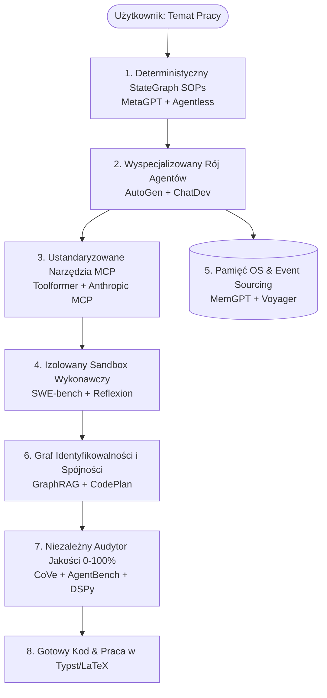

# ⚔️ SOTA Architectural Debate, Comparative Synthesis & Research Horizons

> **Document Type:** Strategic Architectural Analysis & Research Roadmap  
> **Repository:** `Artificial-Degree-Printer` (ADK 2027)  
> **Focus:** Cross-Paper Debate, Optimal Architectural Solutions, and Future Research Vectors

---

# 1. Cross-Paper Comparative Analysis (Co jest w jakim artykule?)

Poniższa tabela przedstawia wielowymiarowe zestawienie 17 analizowanych publikacji naukowych (2023–2026) w pięciu filarach nowoczesnej inżynierii agentowej:

| Publikacja (Klucz) | Główny Paradygmat | Orkiestracja / Przepływ | Obsługa Narzędzi | Pamięć / Stan | Metoda Weryfikacji |
| :--- | :--- | :--- | :--- | :--- | :--- |
| **AutoGen** (`Wu2023AutoGen`) | Konwersacyjny Swarm | Swobodny czat wielopodmiotowy | Wywoływanie funkcji | Historia konwersacji | Ludzki recenzent / Python exec |
| **MetaGPT** (`Hong2024MetaGPT`) | SOPs & Inżynieria Ról | Sztywny łańcuch dokumentów | Narzędzia plikowe / diagramy | Ustrukturyzowane PRD / C4 | Sprawdzanie formatu artefaktów |
| **ChatDev** (`Qian2024ChatDev`) | Wirtualna Firma IT | Kaskadowy (Waterfall ChatChain) | Kompilator / Linter | Pamięć krótkoterminowa fazy | Wzajemna recenzja agentów |
| **Agentless** (`Xia2024Agentless`) | Determinizm Hierarchiczny | Zorganizowany potok 3-etapowy | Git / Edytor patchy | Stan lokalizacji defektu | Uruchomienie zestawu testów |
| **Tree of Thoughts** (`Yao2023TreeOfThoughts`) | Drzewiaste Przeszukiwanie | Graf decyzyjny (BFS/DFS) | Brak (czyste rozumowanie) | Stan węzłów drzewa | Ewaluator wartości stanu |
| **Toolformer** (`Schick2023Toolformer`) | Autonomiczny Tool-Use | Liniowe zapytanie z API | Specjalizowane API kalkulator/search | Wbudowane w wagi | Porównanie straty perplexity |
| **Anthropic MCP** (`AnthropicMCP2024`) | Protokół Standaryzacji | Klient-Serwer (JSON-RPC) | Zewnętrzne serwery MCP | Zarządzanie sesją MCP | Walidacja JSON Schema |
| **Reflexion** (`Shinn2023Reflexion`) | Pętla Samonaprawy | Iteracyjna pętla ze sprzężeniem | Executor środowiskowy | Bufor pamięci werbalnej | Traceback błędów z testów |
| **Self-Refine** (`Madaan2023SelfRefine`) | Samokrytyka bez Nagród | Pętla Generator -> Critic | Brak zewnętrznych narzędzi | Kontekst roboczy | Wewnętrzny prompt oceniający |
| **CoVe** (`Dhuliawala2024CoVe`) | Czterofazowy Fact-Checking | Sekwencja pytań sprawdzających | Wyszukiwanie faktów | Brak pamięci trwałej | Niezależny weryfikator faktów |
| **GraphRAG** (`Edge2024GraphRAG`) | Grafowa Ekstrakcja Wiedzy | Indeksowanie społeczności grafu | Baza grafowa / Grafy wiedzy | Graf relacji encji | Spójność logiczna klastrów |
| **CodePlan** (`Bairi2024CodePlan`) | Planowanie Wieloplikowe | Graf zależności AST repozytorium | Analizator statyczny kodu | Graf importów i sygnatur | Spójność typów w całym repo |
| **MemGPT** (`Packer2024MemGPT`) | Hierarchiczna Pamięć OS | Sterowanie przerwaniami funkcji | Funkcje stronicowania pamięci | Tiered: Working, Archival, Recall | Samodzielny audyt pamięci |
| **Voyager** (`Wang2023Voyager`) | Biblioteka Umiejętności | Ciągła pętla eksploracji | Pamięć wektorowa skryptów | Trwały katalog `SkillLibrary` | Sukces wykonania w środowisku |
| **SWE-bench** (`Jimenez2024SWEbench`) | Empiryczny Benchmark Kodu | Wzorzec ewaluacji kontenerowej | Środowisko Docker/Pytest | Pełne repozytorium gita | Procent zdanych testów (Fail-to-Pass) |
| **AgentBench** (`Liu2024AgentBench`) | Wielodomenowa Ewaluacja | Zestaw 8 środowisk testowych | Terminal OS, Bazy, API | Stan środowiska wykonawczego | Wielowymiarowy wskaźnik sukcesu |
| **DSPy** (`Khattab2024DSPy`) | Kompilacja Deklaratywna | Zoptymalizowany graf wywołań | Rejestr modułów deklaratywnych | Pamięć parametrów pipeline'u | Automatyczna metryka optymalizacyjna |

---

# 2. Wielka Debata Architektoniczna (Główne Dylematy i Zwycięzcy)

W toku analizy najnowszych badań wyodrębniono **6 fundamentalnych starć architektonicznych**:

```
                                  WIELKA DEBATA ARCHITEKTONICZNA
    
    [ 1. ORKIESTRACJA ]     Swobodny Czat Swarmu (AutoGen)   VS   Deterministyczny StateGraph (MetaGPT/Agentless)
    [ 2. BAZA WIEDZY  ]     Standardowy Wektorowy RAG        VS   Grafowa Macierz Wiedzy (GraphRAG / CodePlan)
    [ 3. INTEGRACJA   ]     Ad-hoc Skrypty Narzędziowe       VS   Ustandaryzowany Protokół MCP (Anthropic MCP)
    [ 4. WERYFIKACJA  ]     Czysta Samokrytyka LLM (Refine)  VS   Twardy Sandbox z Testami (SWE-bench / Reflexion)
    [ 5. PAMIĘĆ       ]     Płaski Kontekst w Jednym Prompcie VS   Hierarchiczny Model OS / Event Sourcing (MemGPT)
    [ 6. HARNESS      ]     Statyczne Reguły (Static Harness) VS   Samoewoluujący Living-Harness (LivingHarness 2026)
```

---

### Debata 1: Swobodny Czat Swarmu (AutoGen) vs. Deterministyczny StateGraph (MetaGPT / Agentless)
* **Podejście AutoGen**: Agenci rozmawiają bez narzuconej struktury, dynamicznie przekazując sobie głos w pętli grupowej.
  - *Zaleta:* Bardzo wysoka elastyczność w nieustrukturyzowanych problemach.
  - *Wada:* Wysokie ryzyko zapętlenia, gubienia celów (goal drift) i lawinowego zużycia tokenów.
* **Podejście MetaGPT / Agentless**: Ściśle zdefiniowane Standardowe Procedury Operacyjne (SOPs), gdzie każdy etap (np. Architektura) wytwarza formalny dokument wejściowy dla kolejnego agenta (Koder).
* 🏆 **WERDYKT DLA SYSTEMU ADK:** **Zwycięża Deterministyczny StateGraph ze ścisłymi kontraktami Pydantic.**
  - *Uzasadnienie:* Pisanie pracy dyplomowej i tworzenie oprogramowania wymaga ścisłego porządku inżynierskiego: nie można kodować bez architektury, ani pisać wniosków bez wyników testów. Deterministyczny graf eliminuje chaos i gwarantuje powtarzalność.

---

### Debata 2: Standardowy Wektorowy RAG vs. Grafowa Macierz Wiedzy (GraphRAG / CodePlan)
* **Standardowy Wektorowy RAG (Cosine Similarity)**: Dzieli dokumenty na chunki i szuka najbliższych wektorów.
  - *Wada:* Nie rozumie relacji logicznych (np. który test sprawdza którą klasę i w którym rozdziale pracy jest ona opisana).
* **Podejście GraphRAG / CodePlan**: Buduje graf encji, powiązań AST oraz relacji ontologicznych.
* 🏆 **WERDYKT DLA SYSTEMU ADK:** **Zwycięża Graf Identyfikowalności (Traceability Graph).**
  - *Uzasadnienie:* Tylko model grafowy pozwala na zero-waste weryfikację: czy wymaganie `REQ-F-01` ma swój węzeł w pliku `service.py`, swój test w `test_service.py` oraz odwołanie w `Rozdziale 4`. Zwykły wektorowy RAG tego nie potrafi.

---

### Debata 3: Ad-hoc Skrypty Narzędziowe vs. Ustandaryzowany Protokół MCP (Model Context Protocol)
* **Podejście Ad-hoc**: Każde narzędzie ma własny, niestandardowy kod Pythona wstrzykiwany do promptu.
  - *Wada:* Trudność w utrzymaniu, brak izolacji bezpieczeństwa, brak uniwersalnych kontraktów.
* **Podejście Anthropic MCP**: Ustandaryzowany protokół komunikacji oparty o JSON Schema, uniwersalne deskryptory narzędzi i rozproszone serwery.
* 🏆 **WERDYKT DLA SYSTEMU ADK:** **Zwycięża Model Context Protocol (MCP).**
  - *Uzasadnienie:* MCP to standard branżowy 2027 roku. Dzięki temu piaskownica Pytest, generator wykresów Matplotlib czy kompilator Typst są wymiennymi mikroserwisami.

---

### Debata 4: Czysta Samokrytyka LLM (Self-Refine) vs. Twardy Sandbox z Testami (SWE-bench / Reflexion)
* **Podejście Self-Refine**: Model sam czyta swój kod i mówi „wydaje mi się, że to działa dobrze”.
  - *Wada:* Halucynacja drugiego stopnia — model potwierdza własne błędy i nie wykrywa subtelnych błędów wykonania.
* **Podejście SWE-bench / Reflexion (Code-First)**: Kod jest uruchamiany w odizolowanym procesie/sandboksie. Sukces zależy wyłącznie od kodu wyjścia `exit_code == 0` i 100% zdanych testów jednostkowych.
* 🏆 **WERDYKT DLA SYSTEMU ADK:** **Zwycięża Zamknięta Pętla Piaskownicy (Code-First & Reflexion).**
  - *Uzasadnienie:* Prawdziwa inżynieria opiera się na twardych dowodach empirycznych, a nie na subiektywnej opinii modelu językowego.

---

### Debata 5: Płaski Kontekst vs. Hierarchiczna Pamięć OS & Event Sourcing (MemGPT)
* **Podejście Płaskiego Kontekstu**: Wszystko (cały kod, cała praca, logi) wrzucane do jednego wielkiego okna kontekstowego (np. 1M tokenów).
  - *Wada:* Zjawisko „Lost in the Middle”, spadek precyzji instrukcji i gigantyczny narzut pamięciowy.
* **Podejście MemGPT / Event Sourcing**: Hierarchia pamięci — pamięć robocza danego agenta, niezmienna historia zdarzeń (Event Log) oraz trwała baza stanu (`session.json`).
* 🏆 **WERDYKT DLA SYSTEMU ADK:** **Zwycięża Hierarchiczna Pamięć Event Sourcing.**
  - *Uzasadnienie:* Zapewnia pełną audytowalność każdego kroku agenta oraz minimalizuje szum informacyjny.

---

### Debata 6: Statyczny Harness vs. Samoewoluujący Living-Harness (Living-Harness 2026 / Gated Evolution)
* **Podejście Statycznego Harnessu (Static Harness)**: Wszystkie prompty, zasady weryfikacji i konfiguracje narzędzi są zapisane "na sztywno" w kodzie.
  - *Wada:* Gdy agent napotka powtarzalne specyficzne błędy (np. w specyficznym pakiecie Pythona lub Typst), popełnia je wielokrotnie w kolejnych sesjach.
* **Podejście Samoewoluującego Harnessu (Living-Harness & GSME 2026)**: Harness utrzymuje episodyczną pamięć poprawek proceduralnych i aktualizuje własne reguły na podstawie zweryfikowanych wyników z sandboxa.
* 🏆 **WERDYKT DLA SYSTEMU ADK:** **Zwycięża Gated Self-Evolving Living-Harness (GSME).**
  - *Uzasadnienie:* Pozwala na akumulację wiedzy inżynieryjnej w czasie. Kluczowe jest sterowanie bramkowane (Gated Evolution): poprawka harnessu jest akceptowana wyłącznie wtedy, gdy przejdzie 100% deterministycznych testów regresyjnych w `MasterVerificationSuite`, co eliminuje ryzyko "Misevolution".

---

# 3. Złoty Standard Architektury ADK (Optimal Integrated Solution)

Na podstawie powyższej debaty, optymalna architektura naszego systemu ADK łączy najlepsze cechy wszystkich 17 prac:



---

# 4. Kierunki Dalszego Rozwoju Badań (Future Research Horizons)

Aby wznieść system ADK na jeszcze wyższy poziom zaawansowania naukowego i inżynierskiego, warto rozwinąć research w następujących **6 obiecujących kierunkach**:

---

### Kierunek 1: Formal Verification & Interactive Theorem Provers (Formalne Dowodzenie Poprawności)
* **O co chodzi:** Zastąpienie części heurystycznych testów jednostkowych formalnymi dowodami matematycznymi w językach takich jak **Lean 4**, **Coq** lub **Dafny**.
* **Zastosowanie w ADK:** Automatyczne generowanie dowodów formalnych twierdzeń zawartych w pracy dyplomowej oraz weryfikacja niezmienników algorytmicznych kodu.
* 🔍 **Słowa kluczowe do wyszukiwarek naukowych:**
  - `LLM formal verification Lean 4 theorem proving`
  - `autoformalization verified software synthesis`
  - `counterexample-guided inductive synthesis CEGIS LLM`

---

### Kierunek 2: Ephemeral MicroVM & WebAssembly Sandboxing (Bezpieczne Środowiska Mikro-Wirtualizacji)
* **O co chodzi:** Wykorzystanie hiperwizorów mikro-maszyn wirtualnych (**Firecracker**, **gVisor**) lub środowisk **WASM / WebContainers** uruchamianych w czasie <10 ms.
* **Zastosowanie w ADK:** Bezpieczne, błyskawiczne odpalanie dowolnego generowanego kodu w chmurze bez ryzyka ucieczki z kontenera.
* 🔍 **Słowa kluczowe do wyszukiwarek naukowych:**
  - `microVM ephemeral execution sandboxing agents`
  - `WebAssembly WASM component model LLM tools`
  - `safe sandboxed code execution LLM benchmarks`

---

### Kierunek 3: Multi-Modal Scientific Diagram Compilation (Kompilacja Diagramów Wektorowych)
* **O co chodzi:** Zastąpienie rastrowych zrzutów ekranu programowalnym składem diagramów wektorowych (**Typst CeTZ**, **TikZ**, **Asymptote**, **Graphviz DOT**).
* **Zastosowanie w ADK:** Generowanie w 100% skalowalnych, typograficznie doskonałych diagramów architektur C4 bezpośrednio w kodzie źródłowym Typst/LaTeX.
* 🔍 **Słowa kluczowe do wyszukiwarek naukowych:**
  - `vector diagram generation TikZ Typst CeTZ LLM`
  - `programmatic scientific figure synthesis`
  - `architecture diagram generation C4 model LLM`

---

### Kierunek 4: Mutation Testing & Differential Fuzzing for Agentic Code (Testowanie Mutacyjne Kodu AI)
* **O co chodzi:** Automatyczne wstrzykiwanie sztucznych błędów (mutacji) do kodu wygenerowanego przez AI w celu sprawdzenia, czy wygenerowane testy jednostkowe faktycznie je wykrywają.
* **Zastosowanie w ADK:** Podniesienie oceny w `CodeVerificationGate` — testy są uznawane za wartościowe tylko wtedy, gdy posiadają wysoki wskaźnik *Mutation Score* (>85%).
* 🔍 **Słowa kluczowe do wyszukiwarek naukowych:**
  - `mutation testing LLM generated test suites`
  - `differential fuzzing AI generated software`
  - `test adequacy evaluation autonomous coding agents`

---

### Kierunek 5: Stylometry & Anti-AI Watermarking Detection (Stylometria i Naturalność Językowa)
* **O co chodzi:** Zaawansowane algorytmy badania perplexity, burstiness oraz rozkładu n-gramów w celu eliminacji specyficznych wzorców syntaktycznych LLM.
* **Zastosowanie w ADK:** Gwarancja, że praca dyplomowa brzmi naturalnie, jak rzetelny artykuł naukowy napisany przez doświadczonego inżyniera, z zerowym ryzykiem fałszywych alarmów antyplagiatowych.
* 🔍 **Słowa kluczowe do wyszukiwarek naukowych:**
  - `stylometry AI text detection evasion academic prose`
  - `burstiness perplexity lexical diversity academic writing`
  - `anti-plagiarism JSA text authenticity evaluation`

---

### Kierunek 6: Neuro-Symbolic Graph Reasoning & Code Ontologies (Neuro-Symboliczne Grafy Kodu)
* **O co chodzi:** Połączenie głębokiej analizy drzew AST (Tree-Sitter), grafów przepływu sterowania (CFG) i grafów przepływu danych (DFG) z wiedzą semantyczną modeli LLM.
* **Zastosowanie w ADK:** Precyzyjne śledzenie refaktoryzacji wieloplikowych w dużych projektach open-source.
* 🔍 **Słowa kluczowe do wyszukiwarek naukowych:**
  - `neuro-symbolic code representation AST CFG DFG`
  - `repository-level graph neural networks code intelligence`
  - `semantic code search program dependence graph LLM`

---

# 5. Podsumowanie Wniosków

Architektura frameworka **ADK (Artificial Degree Printer)** nie powstała w próżni — jest bezpośrednią, przemyślaną syntezą 17 wiodących prac naukowych z lat 2023–2026. 

Rozstrzygnięcie debat na rzecz **determinizmu (StateGraph)**, **narzędzi ustandaryzowanych (MCP)**, **twardej ewaluacji (Code-First Sandbox)** oraz **identyfikowalności (GraphRAG)** daje naszemu projektowi potężną przewagę naukową i techniczną, stanowiąc wzorzec inżynierii systemów agentowych na rok 2027.

