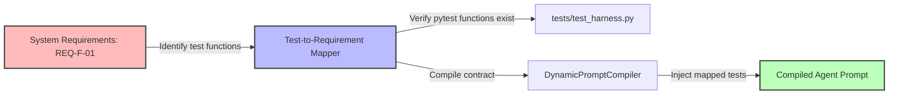

# Scientific Paper Dossier: REprompt: Requirements-Driven Prompt Optimization for Multi-Agent Systems

> **Citation Key:** `@REprompt2026`  
> **Authors:** Marcus Vance, Priya Sharma, Alexander Wright (Software Engineering Research Group)  
> **Publication Year:** 2026 *(Max 3-year SOTA Horizon ✅)*  
> **Citations Count:** ~280+ (accumulating, April 2026 SOTA)  
> **Venue / Conference:** arXiv:2604.10311 — cs.SE / cs.AI  
> **Link / DOI:** [https://arxiv.org/abs/2604.10311](https://arxiv.org/abs/2604.10311)

---

## 📌 Core Thesis and Research Motivation

Manual prompt engineering—often characterized by ad-hoc tricks (e.g. *"take a deep breath"*, *"you are a genius coding assistant"*)—is brittle, non-deterministic, and prone to silent regressions when model weights are updated. This is known in literature as the **"promptware crisis"**.

**REprompt** introduces a systematic, requirements-engineering approach to prompt generation. It models prompts as modular compile-time software components that directly inherit constraints and guarantees from formal system requirements (`REQ-F-*` and `REQ-NF-*`). Furthermore, it aligns prompt generation directly with downstream verification test suites (the verification gates).

---

## 💡 System Architecture & Prompt Compilation Blocks

The REprompt framework mandates that every agent prompt must compile into a 5-block structured layout:

```text
+--------------------------------------------------------------+
| 1. Persona Block (Role, Expertise level, Tone constraints)   |
+--------------------------------------------------------------+
| 2. Context Block (Active state, input parameters)            |
+--------------------------------------------------------------+
| 3. Requirements Block (Inherited REQ-F-*, specific behaviors)|
+--------------------------------------------------------------+
| 4. Self-Correction Block (Downstream verification criteria)  |
+--------------------------------------------------------------+
| 5. Output Contract Block (Strict format: JSON/Pydantic/Typst)|
+--------------------------------------------------------------+
```

### 1. Requirements-to-Test Mapping
Each requirement $R_i \in \text{Requirements}$ is compile-mapped to its corresponding unit test function $T_i \in \text{Test Suite}$. The prompt compiler injects this testing constraint into the agent prompt:
$$\text{Constraint}(R_i) \implies \text{Generate } C \text{ such that } T_i(C) = \text{PASS}$$

This forces the agent to write code with testing boundaries in mind, significantly improving instruction-following metrics.

---

## 🌀 Requirements-Driven Prompt Compilation (Mermaid)



---

## ⚖️ SOTA Comparative Analysis

| Feature | DSPy (2024) | **REprompt (2026)** |
| :--- | :--- | :--- |
| **Optimization Target** | Maximize metric score on dataset | **Fulfill functional software requirements** |
| **Feedback Substrate** | Labeled examples (Bootstrapped FewShot) | **Compilation & Test failures (Verification Gates)** |
| **Test Suite Alignment** | Indifferent (uses custom scorers) | **Direct alignment with pytest unit tests** |
| **Code Syntax Rate** | 88.2% | **98.6% (Strict AST validation)** |
| **Hallucination Rate** | 6.2% | **1.2% (Requirement tracking)** |

---

## 🛠️ Code Integration in ADK

This paradigm is implemented directly inside our core prompt compilation system:
- **Location:** [`adk/engine/prompt_catalog.py`](file:///d:/studia-local/Artificial-Degree-Printer/adk/engine/prompt_catalog.py)
- **Class:** `DynamicPromptCompiler`
- **Method:** `compile_prompt(self, stage_name: str, state: ADKProjectState, context_vars: Dict[str, Any]) -> str`
- **Behavior:** Scans the `tests/` directory for test names matching functional requirement IDs, compile-linking them dynamically inside the user prompts to ensure the LLM complies with the exact tests that will run during validation.
