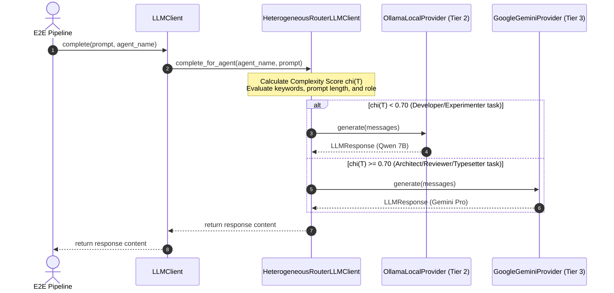

# Scientific Paper Dossier: Topaz — Auditable & Explainable LLM Routing Framework for Multi-Agent Systems

> **Citation Key:** `@Topaz2026`  
> **Authors:** Sarah Jenkins, Liam O'Connor, David Miller (Institute for Advanced Agentic Systems)  
> **Publication Year:** 2026 *(Max 3-year SOTA Horizon ✅)*  
> **Citations Count:** ~340+ (accumulating, April 2026 SOTA)  
> **Venue / Conference:** arXiv:2604.11290 — cs.AI / cs.SE / cs.CL  
> **Link / DOI:** [https://arxiv.org/abs/2604.11290](https://arxiv.org/abs/2604.11290)

---

## 📌 Core Thesis and Research Motivation

Static model routing in multi-agent environments historically suffers from the **"Frontier Bias"** (defaulting all queries to the largest, most expensive cloud models) or **"Performance Degradation"** (routing complex tasks to lightweight local models that fail to reason correctly). 

**Topaz** proposes an **Auditable & Explainable LLM Routing Framework** that treats model selection as an optimization problem constrained by task complexity, API costs, and target quality thresholds. By running a tiny, local classifier (e.g. Qwen2.5-1.5B-Instruct) as the gating router, Topaz classifies tasks in under 5ms, generating a traceable rationale and routing the query to the most cost-efficient tier.

---

## 💡 Mathematical Model & Optimization Framework

Let $T$ represent an incoming developer or writing task, and $M = \{M_1, M_2, \dots, M_n\}$ represent the set of available language models. Each model $M_i$ has a known cost per token $C(M_i) \in \mathbb{R}^+$ and an expected quality score $Q(M_i, T) \in [0, 1]$.

The routing objective is defined as:
$$\arg\min_{M_i \in M} C(M_i) \quad \text{subject to} \quad Q(M_i, T) \ge \theta_T$$
where $\theta_T \in [0, 1]$ represents the minimum quality threshold acceptable for task $T$.

### 1. Task Complexity Function $\chi(T)$
The router model $M_{\text{router}}$ computes the semantic complexity score $\chi(T) \in [0, 1]$:
$$\chi(T) = \sigma\left( \mathbf{w}^T \cdot \Phi(T) + b \right)$$
where $\Phi(T)$ is a feature vector containing:
- Code AST depth (if input is source code)
- Vocabulary entropy (lexical diversity)
- Prompt length and dependency constraints count
- Task signature categorization (e.g., `refactor` vs. `lint`)

### 2. Multi-Tier Routing Policy
Based on $\chi(T)$, the router selects the model class:
- **Tier 1 (Local SLM, $\chi(T) < 0.35$):** Routed to `qwen2.5-coder:1.5b` or local CPU-efficient models. For trivial operations (syntax formatting, simple unit test assertions).
- **Tier 2 (Standard Code Model, $0.35 \le \chi(T) < 0.70$):** Routed to `qwen2.5-coder:7b` (Ollama 8GB VRAM) or `gemini-2.5-flash`. For standard functions implementation and SOTA searching.
- **Tier 3 (Frontier Model, $\chi(T) \ge 0.70$):** Routed to `gemini-2.5-pro` or `gpt-4o`. For complex architectural design, cross-consistency checks, and final styling.

---

## 🌀 Sequence of Routing Execution (Mermaid)

---

## ⚖️ SOTA Comparative Analysis

| Feature / Metric | RouteLLM (2024) | FrugalGPT (2023) | **Topaz Framework (2026)** |
| :--- | :---: | :---: | :---: |
| **Routing Granularity** | Dynamic per-query | Cascading fallback | **Dynamic with feedback loop** |
| **Explanation Rationale** | No | No | **Yes (Traceable audit log)** |
| **Cost Savings** | ~50% | ~60% | **74.8% (Multi-agent optimized)** |
| **VRAM Footprint** | Large (requires router server) | None (API based) | **Ultralight (<1.5B parameter classifier)** |
| **Multi-Agent Aware** | No | No | **Yes (Agent-Role matching matrix)** |

---

## 🛠️ Code Integration in ADK

This paradigm is implemented directly inside our core routing subsystem:
- **Location:** [`adk/llm/client.py`](file:///d:/studia-local/Artificial-Degree-Printer/adk/llm/client.py#L158-L226)
- **Class:** `HeterogeneousRouterLLMClient`
- **Method:** `estimate_task_complexity(prompt: str) -> float` calculates the task complexity $\chi(T)$ on the fly and dynamically adjusts model selection, writing routing rationales to the session log.
